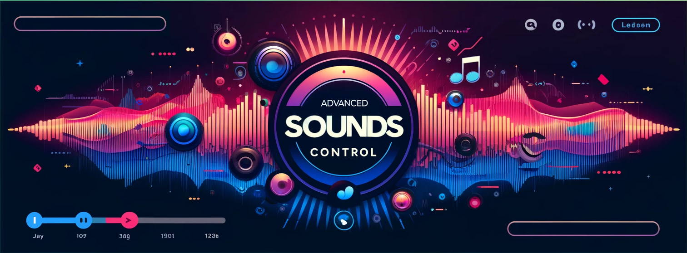

# üéµ Sounds Control [](README.pt.md) [](README.es.md) [](README.md)

<p align="center">
  
  <br />
  <strong>Una biblioteca de audio JavaScript/TypeScript versátil para control avanzado de sonido</strong>
  <br />
  Perfecta para juegos, aplicaciones web y desarrollo móvil
</p>

<p align="center">
  <a href="https://www.npmjs.com/package/sounds-control">
    
  </a>
  <a href="https://www.npmjs.com/package/sounds-control">
    
  </a>
  <a href="https://www.npmjs.com/package/sounds-control">
    
  </a>
  <a href="https://github.com/hangell/sounds-control">
    
  </a>
  <a href="https://github.com/hangell/sounds-control/stargazers">
    
  </a>
</p>

## ✨ Características

- 🎮 **Listo para juegos**: Optimizado para aplicaciones de juego con audio de baja latencia
- 📱 **Mobile-first**: Integración perfecta de audio para entornos móviles
- ⚡ **Compatible con frameworks**: Funciona perfectamente con Ionic, React Native, Vue, Angular y JavaScript vanilla
- 🔄 **Controles avanzados**: Loop, pausar, reanudar, control de velocidad y gestión de volumen
- 🎯 **Sistema de efectos**: Efectos de sonido dedicados con control de volumen separado
- 📦 **Soporte TypeScript**: Definiciones completas de TypeScript incluidas
- 🌐 **Multiplataforma**: Soporte para Web, Android, iOS
- 🎛️ **Web Audio API**: Construido sobre la moderna Web Audio API para rendimiento superior

## 🚀 Inicio Rápido

### Instalación

```bash
npm install sounds-control
```

### Uso Básico

```javascript
import { SoundsControl } from 'sounds-control';

const soundsControl = new SoundsControl();

// Cargar y reproducir un sonido
async function playMusic() {
  await soundsControl.loadSound('./assets/music.mp3', 'background-music');
  soundsControl.play('background-music');
}

playMusic();
```

## 📖 Referencia de la API

### Métodos Principales

#### `loadSound(url: string, id: string): Promise<void>`
Carga un archivo de audio desde una URL y lo decodifica para uso posterior.

```javascript
await soundsControl.loadSound('./sounds/explosion.mp3', 'explosion');
```

#### `isSoundLoaded(id: string): boolean`
Verifica si un sonido ha sido cargado y está listo para reproducir.

```javascript
if (soundsControl.isSoundLoaded('explosion')) {
  // El sonido está listo para reproducir
}
```

#### `play(id: string, startTime?: number): Promise<void>`
Reproduce un sonido desde un tiempo inicial especificado (en segundos).

```javascript
// Reproducir desde el inicio
await soundsControl.play('background-music');

// Reproducir desde los 30 segundos
await soundsControl.play('background-music', 30);
```

#### `playEffect(id: string): Promise<void>`
Reproduce un efecto de sonido usando el canal de audio dedicado para efectos.

```javascript
await soundsControl.playEffect('coin-pickup');
```

#### `stop(id: string): void`
Detiene la reproducción de un sonido y almacena el tiempo de pausa para reanudación posterior.

```javascript
soundsControl.stop('background-music');
```

#### `loop(id: string, startTime?: number): void`
Reproduce un sonido continuamente en bucle desde un tiempo inicial especificado.

```javascript
soundsControl.loop('ambient-sound');
```

### Control de Volumen

#### `setVolume(volume: number): void`
Establece el volumen maestro para todos los sonidos (0.0 a 1.0).

```javascript
soundsControl.setVolume(0.5); // Volumen al 50%
```

#### `setEffectVolume(volume: number): void`
Establece el volumen solo para efectos de sonido (0.0 a 1.0).

```javascript
soundsControl.setEffectVolume(0.8); // Volumen al 80% para efectos
```

### Control de Velocidad de Reproducción

#### `setPlaybackRate(id: string, rate: number): void`
Establece la velocidad de reproducción para un sonido específico.

```javascript
soundsControl.setPlaybackRate('music', 1.5); // Velocidad 1.5x
```

#### `setGlobalPlaybackRate(rate: number): void`
Establece la velocidad de reproducción para todos los sonidos que se están reproduciendo actualmente.

```javascript
soundsControl.setGlobalPlaybackRate(0.5); // Velocidad a la mitad para todos los sonidos
```

#### `faster(id: string, rate?: number): void`
Hace que un sonido se reproduzca más rápido (por defecto: velocidad 1.5x).

```javascript
soundsControl.faster('dialogue'); // Velocidad 1.5x
soundsControl.faster('dialogue', 2.0); // Velocidad 2x
```

#### `slow(id: string, rate?: number): void`
Hace que un sonido se reproduzca más lento (por defecto: velocidad 0.75x).

```javascript
soundsControl.slow('music'); // Velocidad 0.75x
```

### Controles Globales

#### `pauseAll(): void`
Pausa todos los sonidos que se están reproduciendo actualmente y almacena sus tiempos de pausa.

```javascript
soundsControl.pauseAll();
```

#### `resumeAll(): void`
Reanuda todos los sonidos pausados desde sus tiempos de pausa almacenados.

```javascript
soundsControl.resumeAll();
```

## 🔧 Integración con Frameworks

### Angular / Ionic

#### Configuración del Service

```typescript
// audio.service.ts
import { Injectable } from '@angular/core';
import { SoundsControl } from 'sounds-control';

@Injectable({
  providedIn: 'root'
})
export class AudioService {
  private soundsControl: SoundsControl;

  constructor() {
    this.soundsControl = new SoundsControl();
  }

  async loadSound(url: string, id: string): Promise<void> {
    await this.soundsControl.loadSound(url, id);
  }

  play(id: string, startTime?: number): void {
    this.soundsControl.play(id, startTime);
  }

  playEffect(id: string): void {
    this.soundsControl.playEffect(id);
  }

  setVolume(volume: number): void {
    this.soundsControl.setVolume(volume);
  }

  pauseAll(): void {
    this.soundsControl.pauseAll();
  }

  resumeAll(): void {
    this.soundsControl.resumeAll();
  }
}
```

#### Uso en Component

```typescript
// game.component.ts
import { Component, OnInit } from '@angular/core';
import { AudioService } from './audio.service';

@Component({
  selector: 'app-game',
  templateUrl: './game.component.html'
})
export class GameComponent implements OnInit {
  
  constructor(private audioService: AudioService) {}

  async ngOnInit() {
    // Cargar sonidos del juego
    await this.audioService.loadSound('./assets/background.mp3', 'bg-music');
    await this.audioService.loadSound('./assets/jump.mp3', 'jump-effect');
    
    // Iniciar música de fondo
    this.audioService.play('bg-music');
  }

  onJump() {
    this.audioService.playEffect('jump-effect');
  }
}
```

#### Gestión del Estado de la App (Ionic)

```typescript
// app.component.ts
import { Component, OnInit } from '@angular/core';
import { App } from '@capacitor/app';
import { AudioService } from './services/audio.service';

@Component({
  selector: 'app-root',
  templateUrl: 'app.component.html'
})
export class AppComponent implements OnInit {

  constructor(private audioService: AudioService) {}

  ngOnInit() {
    // Manejar cambios de estado de la app para móvil
    App.addListener('appStateChange', ({ isActive }) => {
      if (isActive) {
        this.audioService.resumeAll();
      } else {
        this.audioService.pauseAll();
      }
    });
  }
}
```

### React

#### Implementación basada en Hook

```tsx
import React, { useEffect, useState, useRef } from 'react';
import { SoundsControl } from 'sounds-control';

const useAudio = () => {
  const soundsControlRef = useRef<SoundsControl>();
  const [isLoaded, setIsLoaded] = useState(false);

  useEffect(() => {
    soundsControlRef.current = new SoundsControl();
    setIsLoaded(true);

    return () => {
      // Limpieza al desmontar
      soundsControlRef.current?.pauseAll();
    };
  }, []);

  return {
    soundsControl: soundsControlRef.current,
    isLoaded
  };
};

// Componente del Juego
const Game: React.FC = () => {
  const { soundsControl, isLoaded } = useAudio();
  const [soundsReady, setSoundsReady] = useState(false);

  useEffect(() => {
    const loadSounds = async () => {
      if (!soundsControl || !isLoaded) return;

      try {
        await soundsControl.loadSound('./assets/music.mp3', 'bg-music');
        await soundsControl.loadSound('./assets/click.mp3', 'click');
        setSoundsReady(true);
        
        // Iniciar música de fondo
        soundsControl.play('bg-music');
      } catch (error) {
        console.error('Error al cargar sonidos:', error);
      }
    };

    loadSounds();
  }, [soundsControl, isLoaded]);

  const handleClick = () => {
    if (soundsReady && soundsControl) {
      soundsControl.playEffect('click');
    }
  };

  return (
    <div className="game">
      <button onClick={handleClick} disabled={!soundsReady}>
        {soundsReady ? '¡Haz clic!' : 'Cargando...'}
      </button>
    </div>
  );
};

export default Game;
```

### Vue 3

#### Composition API

```vue
<template>
  <div class="audio-player">
    <button @click="playMusic" :disabled="!soundsReady">Reproducir Música</button>
    <button @click="playEffect" :disabled="!soundsReady">Reproducir Efecto</button>
    <button @click="pauseAll">Pausar Todo</button>
    <button @click="resumeAll">Reanudar Todo</button>
    
    <div class="controls">
      <label>Volumen Principal: {{ volume }}</label>
      <input 
        type="range" 
        min="0" 
        max="1" 
        step="0.1" 
        v-model="volume" 
        @input="updateVolume"
      />
    </div>
  </div>
</template>

<script setup lang="ts">
import { ref, onMounted, onUnmounted } from 'vue';
import { SoundsControl } from 'sounds-control';

const soundsControl = new SoundsControl();
const soundsReady = ref(false);
const volume = ref(1);

onMounted(async () => {
  try {
    await soundsControl.loadSound('./assets/music.mp3', 'music');
    await soundsControl.loadSound('./assets/beep.mp3', 'beep');
    soundsReady.value = true;
  } catch (error) {
    console.error('Error al cargar sonidos:', error);
  }
});

onUnmounted(() => {
  soundsControl.pauseAll();
});

const playMusic = () => {
  soundsControl.play('music');
};

const playEffect = () => {
  soundsControl.playEffect('beep');
};

const pauseAll = () => {
  soundsControl.pauseAll();
};

const resumeAll = () => {
  soundsControl.resumeAll();
};

const updateVolume = () => {
  soundsControl.setVolume(volume.value);
};
</script>
```

## 🎮 Ejemplos de Desarrollo de Juegos

### Gestor de Audio Simple para Juegos

```typescript
class GameAudioManager {
  private soundsControl: SoundsControl;
  private musicVolume = 0.7;
  private effectsVolume = 1.0;

  constructor() {
    this.soundsControl = new SoundsControl();
    this.init();
  }

  private async init() {
    // Cargar todos los sonidos del juego
    const sounds = [
      { url: './assets/music/bg-music.mp3', id: 'bg-music' },
      { url: './assets/sfx/jump.mp3', id: 'jump' },
      { url: './assets/sfx/coin.mp3', id: 'coin' },
      { url: './assets/sfx/explosion.mp3', id: 'explosion' },
    ];

    await Promise.all(
      sounds.map(sound => this.soundsControl.loadSound(sound.url, sound.id))
    );

    this.soundsControl.setVolume(this.musicVolume);
    this.soundsControl.setEffectVolume(this.effectsVolume);
  }

  startBackgroundMusic() {
    this.soundsControl.loop('bg-music');
  }

  playJumpSound() {
    this.soundsControl.playEffect('jump');
  }

  playCoinSound() {
    this.soundsControl.faster('coin', 1.2); // Ligeramente más rápido para emoción
    this.soundsControl.playEffect('coin');
  }

  playExplosion() {
    this.soundsControl.playEffect('explosion');
  }

  pauseGame() {
    this.soundsControl.pauseAll();
  }

  resumeGame() {
    this.soundsControl.resumeAll();
  }

  setMusicVolume(volume: number) {
    this.musicVolume = volume;
    this.soundsControl.setVolume(volume);
  }

  setEffectsVolume(volume: number) {
    this.effectsVolume = volume;
    this.soundsControl.setEffectVolume(volume);
  }
}
```

## 🛠️ Uso Avanzado

### Carga Dinámica de Sonidos

```typescript
class DynamicAudioLoader {
  private soundsControl: SoundsControl;
  private loadingPromises: Map<string, Promise<void>> = new Map();

  constructor() {
    this.soundsControl = new SoundsControl();
  }

  async loadSoundIfNeeded(url: string, id: string): Promise<void> {
    if (this.soundsControl.isSoundLoaded(id)) {
      return;
    }

    if (this.loadingPromises.has(id)) {
      return this.loadingPromises.get(id);
    }

    const promise = this.soundsControl.loadSound(url, id);
    this.loadingPromises.set(id, promise);

    try {
      await promise;
    } finally {
      this.loadingPromises.delete(id);
    }
  }

  async playWithAutoLoad(url: string, id: string): Promise<void> {
    await this.loadSoundIfNeeded(url, id);
    return this.soundsControl.play(id);
  }
}
```

## 📱 Consideraciones para Móvil

### Activación del Contexto de Audio en iOS

```typescript
// Para iOS, el contexto de audio necesita interacción del usuario para iniciar
const initializeAudio = async () => {
  const soundsControl = new SoundsControl();
  
  // Agregar un listener de interacción del usuario
  const activateAudio = async () => {
    try {
      // Cargar un sonido silencioso corto para activar el contexto de audio
      await soundsControl.loadSound('./assets/silence.mp3', 'silence');
      await soundsControl.play('silence');
      
      document.removeEventListener('touchstart', activateAudio);
      document.removeEventListener('click', activateAudio);
    } catch (error) {
      console.error('Error al activar audio:', error);
    }
  };

  document.addEventListener('touchstart', activateAudio, { once: true });
  document.addEventListener('click', activateAudio, { once: true });
};
```

## 🔧 Solución de Problemas

### Problemas Comunes

**El audio no se reproduce en móvil:**
- Asegúrate de que el audio sea activado por interacción del usuario
- Verifica si el dispositivo está en modo silencioso
- Verifica que los formatos de archivo de audio sean compatibles

**Problemas de rendimiento:**
- Pre-carga sonidos usados frecuentemente
- Usa formatos de audio comprimidos (MP3, AAC)
- Limita las fuentes de audio simultáneas

**Uso de memoria:**
- Descarga buffers de audio no utilizados
- Usa archivos de audio más cortos para efectos
- Considera streaming para pistas de música largas

## 🧪 Pruebas

```typescript
// Ejemplo de configuración de pruebas con Jest
import { SoundsControl } from 'sounds-control';

// Mock AudioContext para pruebas
global.AudioContext = jest.fn().mockImplementation(() => ({
  createGain: jest.fn(() => ({
    connect: jest.fn(),
    gain: { setValueAtTime: jest.fn() }
  })),
  createBufferSource: jest.fn(() => ({
    connect: jest.fn(),
    start: jest.fn(),
    stop: jest.fn(),
    disconnect: jest.fn()
  })),
  decodeAudioData: jest.fn(),
  currentTime: 0,
  destination: {}
}));

describe('SoundsControl', () => {
  let soundsControl: SoundsControl;

  beforeEach(() => {
    soundsControl = new SoundsControl();
  });

  test('debería inicializar sin errores', () => {
    expect(soundsControl).toBeInstanceOf(SoundsControl);
  });

  // Agregar más pruebas...
});
```

## 📄 Licencia

Este proyecto está licenciado bajo la Licencia MIT - consulta el archivo [LICENSE](LICENSE) para más detalles.

## 🤝 Contribuir

¡Las contribuciones son bienvenidas! Siéntete libre de enviar un Pull Request. Para cambios importantes, por favor abre primero un issue para discutir lo que te gustaría cambiar.

### Configuración de Desarrollo

```bash
git clone https://github.com/hangell/sounds-control.git
cd sounds-control
npm install
npm run build
npm test
```

## 💖 Apoyo

Si encontraste útil esta biblioteca, por favor considera:

- ⭐ Darle una estrella en GitHub
- 📝 Reportar problemas o solicitar características
- 💰 Apoyar vía Pix: rodrigo@hangell.org

## 👨‍💻 Autor
<div align="center">


**Rodrigo Rangel**

[](https://hangell.org)
[](https://play.google.com/store/apps/dev?id=5606456325281613718)
[](https://www.youtube.com/channel/UC8_zG7RFM2aMhI-p-6zmixw)
[](https://www.facebook.com/hangell.org)
[](https://www.linkedin.com/in/rodrigo-rangel-a80810170)

</div>

---

<p align="center">
  Hecho con ❤️ para la comunidad de desarrolladores
